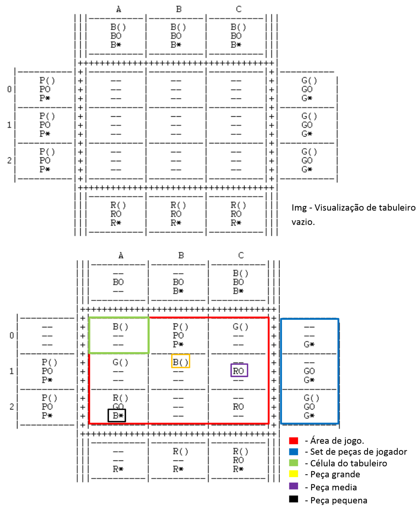

# PLOG - Logic Programming

Projects made in Logic Programming class - MIEIC 3y1s

## Otrio

Implementation of the game Otrio using Prolog. For more information about the implementation and how it works, see the report: 

### How to run
In SICStus do:
1º consult -> "main.pl"
2º Execute: "playGame"

## CuMadness
Implementation of a solution for the CuMadness problem using Prolog. For more information about the implementation and how it works, see the report: 

### How to run
In SICStus do:
1º consult -> "main.pl"
2º Get the solution by executing: "solveCube(X,N)." where N is the size of edge of the cube to solve (N > 0).

A solution is then showed and the user is asked to interact with the console. The user can then: execute "n." for another solution or execute "y." to close the console.
